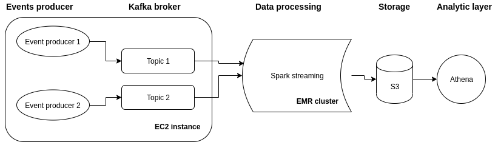
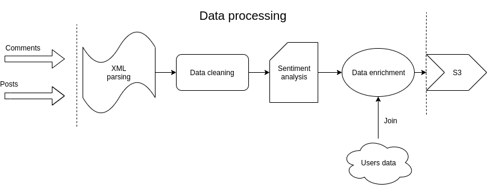

#### Simple Big Data system with elements of sentiment analysis created to process stream of messages based on Apache Spark and Kafka with use of S3 and Athena.

##### Aim and motivation
University final project used as an opportunity to learn and play a bit with Spark, Kafka and AWS services.

##### Data Source
Data come from: https://ia800107.us.archive.org/27/items/stackexchange/ and was used to simulate streams coming to the system. Simulation was done by simple Python script.

##### Architecture

##### Data processing

Most of the steps regarding data processing are self-explanatory, however, sentiment analysis and data enrichment deserves a word of explanation.
* Approach used in sentiment analysis is very simplistic due to efficiency reasons to handle computations in the stream manner. Presented approach utilize lexicon of positive and negative words and based on that score is assigned to each word of a statement. Overall score is average consisting of sum of all scores assigned to each word and sum of all words in a statement.
Approach inspired by article: “Sentiment analysis and subjectivity” Bing Liu and https://datamatters.blog/2011/07/04/twitter-text-mining-r-slides/
* Data enrichment is simply RDD join of streams to static data which add information about users like their login and locations

##### Results
Some of the graphs can be observed in the folder Notebooks.

##### Project content
* ec2-instance – bash scripts used to recreate a kafka broker and to simulate streaming messages
* img - diagrams
* Lexicon – lexicon of positive and negative words used for sentiment analysis
* Notebooks – graphs used for result presentation
* SQL – DDL for Athena tables and sample queries used to generate results
* src – Spark application